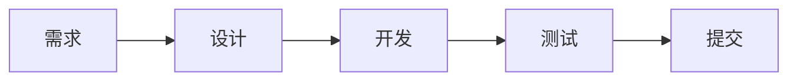

# 项目概要

## 基本信息

| 属性 | 值 |
|------|-----|
| 项目名称 | 数字花园 (Digital Garden) |
| 类型 | 个人博客系统 |
| 许可证 | MIT |
| 当前版本 | v0.2.0 |

## 技术栈

### 核心框架
| 技术 | 版本 | 用途 |
|------|------|------|
| Next.js | 15.1+ | React 框架，静态站点生成 |
| React | 19.0+ | UI 库 |
| TypeScript | 5.7+ | 类型安全 |

### 样式与 UI
| 技术 | 版本 | 用途 |
|------|------|------|
| Tailwind CSS | 3.4+ | 原子化 CSS 框架 |
| Lucide React | - | 图标库 |
| TipTap | 2.27+ | 富文本编辑器 |

### 内容与工具
| 技术 | 版本 | 用途 |
|------|------|------|
| Content Collections | 0.13+ | MDX 内容管理 |
| MDX | - | Markdown + JSX |
| Shiki | 1.24+ | 代码高亮 |
| Sharp | 0.34+ | 图片处理 |

## 项目结构

```
myblog/
├── content/posts/          # 博客文章（MDX）
│   ├── 2023/
│   ├── 2024/
│   └── 2025/
├── public/                 # 静态资源
│   └── uploads/           # 上传的图片
├── src/
│   ├── app/               # Next.js App Router
│   │   ├── (admin)/      # 管理后台（不导出）
│   │   ├── api/          # API 路由（不导出）
│   │   ├── blog/         # 博客页面
│   │   ├── about/        # 关于页面
│   │   └── page.tsx      # 首页
│   ├── components/       # React 组件
│   │   ├── admin/        # 管理后台组件
│   │   ├── blog/         # 博客组件
│   │   ├── layout/       # 布局组件
│   │   └── ui/           # UI 组件
│   ├── lib/              # 工具函数
│   └── styles/           # 样式文件
├── docs/                  # 项目文档
├── scripts/               # 工具脚本
└── content-collections.ts # 内容配置
```

## 核心功能

### 1. 内容管理
- **在线编辑**: 内置管理后台，WYSIWYG 编辑器
- **一键发布**: 保存后自动 git commit & push
- **标签系统**: 文章分类和筛选
- **草稿功能**: 支持草稿保存
- **精选文章**: 标记重要内容

### 2. 用户体验
- **终端风格**: 复古计算机美学设计
- **主题切换**: 亮色/暗色模式
- **响应式设计**: 完美适配各种设备
- **代码高亮**: Shiki 语法高亮
- **阅读体验**: 自动目录、阅读进度条

### 3. 技术特性
- **静态导出**: 纯 HTML/CSS/JS，无服务器依赖
- **SEO 友好**: 自动生成 Sitemap 和 RSS
- **CDN 就绪**: 适合 Cloudflare Pages、Vercel

## 设计系统

### 颜色
```css
--terminal-green: 120 60% 35%;  /* 终端绿 */
--cream-gold: 35 60% 75%;       /* 奶油金 */
--background: 0 0% 100%;        /* 背景色 */
--foreground: 0 0% 3.9%;        /* 前景色 */
```

### 组件
- Terminal Window: 终端窗口样式容器
- Terminal Header: 窗口标题栏
- Button: 终端风格按钮
- Input/Textarea: 表单输入控件

## 开发工作流



### 常用命令
```bash
npm run dev          # 启动开发服务器
npm run build:static # 构建静态站点
npm run preview      # 预览构建结果
npm run lint         # 代码检查
```

## 部署

### 静态导出
- 构建命令: `npm run build:static`
- 输出目录: `out/`
- 管理后台和 API 不导出

### 推荐平台
- Cloudflare Pages
- Vercel
- Netlify

## 版本历史

### v0.2.0 (2025-02)
- 添加管理后台，支持在线编辑文章
- 实现一键发布功能（git commit + push）
- 重新设计为复古终端风格
- 优化移动端体验

### v0.1.0 (2024)
- 初始版本，从 xlog 迁移内容
